# Database Schema Documentation

This documentation describes the database schema used for managing images, categories, products, roles, permissions, users, reports, sellers, currencies, details, invoices, and their relationships in a business management system.

## Relationships

- Each `User` can have a single `Image` and can be linked to a single `Seller`.
- Each `Category` can have multiple `Products`.
- Each `Product` is linked to a single `Category` and a single `Image`.
- Each `Invoice` is linked to a single `Currency`, a single `Detail`, and a single `Seller`.
- Each `Seller` can have multiple `Invoices` and multiple `Reports`.
- Permissions are linked to roles via the `PermissionRole` table.
- Roles are linked to users via the `RoleUser` table.

## Entities Description

### 1. Images

Represents an image used in the system.

| Field          | Type          | Description                      |
|----------------|---------------|----------------------------------|
| id             | integer       | Primary key                      |
| name           | varchar(255)  | Name of the image                |
| url            | varchar(255)  | URL of the image                 |
| created_at     | timestamp     | Timestamp when image was created |
| updated_at     | timestamp     | Timestamp when image was updated |
| deleted_at     | timestamp     | Timestamp when image was deleted |

### 2. Categories

Represents a category to which products belong.

| Field          | Type          | Description                         |
|----------------|---------------|-------------------------------------|
| id             | integer       | Primary key                         |
| name           | varchar(100)  | Name of the category (unique)       |
| description    | varchar(255)  | Description of the category         |
| created_at     | timestamp     | Timestamp when category was created |
| updated_at     | timestamp     | Timestamp when category was updated |
| deleted_at     | timestamp     | Timestamp when category was deleted |

### 3. Products

Represents a product in the system.

| Field            | Type          | Description                         |
|------------------|---------------|-------------------------------------|
| id               | integer       | Primary key                         |
| name             | varchar(100)  | Name of the product (unique)        |
| description      | varchar(255)  | Description of the product          |
| brand            | varchar(100)  | Brand of the product                |
| sale_price       | float         | Sale price of the product           |
| purchase_price   | float         | Purchase price of the product       |
| stock            | integer       | Stock quantity of the product       |
| category_id      | integer       | Foreign key to the category         |
| image_id         | integer       | Foreign key to the image            |
| created_at       | timestamp     | Timestamp when product was created  |
| updated_at       | timestamp     | Timestamp when product was updated  |
| deleted_at       | timestamp     | Timestamp when product was deleted  |

### 4. Roles

Represents a role assigned to users.

| Field          | Type          | Description                      |
|----------------|---------------|----------------------------------|
| id             | integer       | Primary key                      |
| name           | varchar(100)  | Name of the role (unique)        |
| description    | text          | Description of the role          |
| created_at     | timestamp     | Timestamp when role was created  |
| updated_at     | timestamp     | Timestamp when role was updated  |
| deleted_at     | timestamp     | Timestamp when role was deleted  |

### 5. Permissions

Represents a permission that can be assigned to roles.

| Field          | Type          | Description                           |
|----------------|---------------|---------------------------------------|
| id             | integer       | Primary key                           |
| name           | varchar(100)  | Name of the permission (unique)       |
| description    | text          | Description of the permission         |
| created_at     | timestamp     | Timestamp when permission was created |
| updated_at     | timestamp     | Timestamp when permission was updated |
| deleted_at     | timestamp     | Timestamp when permission was deleted |

### 6. Users

Represents a user in the system.

| Field             | Type          | Description                       |
|-------------------|---------------|-----------------------------------|
| id                | integer       | Primary key                       |
| first_name        | varchar(100)  | User's first name                 |
| last_name         | varchar(100)  | User's last name                  |
| email             | varchar(20)   | User's email address              |
| identification    | varchar(20)   | User's identification number      |
| phone             | varchar(20)   | User's phone number               |
| password          | varchar(100)  | User's password                   |
| address           | text          | User's address                    |
| date_of_birth     | date          | User's date of birth              |
| image_id          | integer       | Foreign key to the image          |
| created_at        | timestamp     | Timestamp when user was created   |
| updated_at        | timestamp     | Timestamp when user was updated   |
| deleted_at        | timestamp     | Timestamp when user was deleted   |

### 7. Reports

Represents a report generated in the system.

| Field          | Type          | Description                       |
|----------------|---------------|-----------------------------------|
| id             | integer       | Primary key                       |
| description    | text          | Description of the report         |
| created_at     | timestamp     | Timestamp when report was created |

### 8. Sellers

Represents a seller in the system.

| Field          | Type          | Description                         |
|----------------|---------------|-------------------------------------|
| id             | integer       | Primary key                         |
| code           | varchar(100)  | Seller's code                       |
| report_id      | integer       | Foreign key to the report           |
| user_id        | integer       | Foreign key to the user             |
| created_at     | timestamp     | Timestamp when seller was created   |
| updated_at     | timestamp     | Timestamp when seller was updated   |
| deleted_at     | timestamp     | Timestamp when seller was deleted   |

### 9. Currencies

Represents a currency used in the system.

| Field          | Type          | Description                         |
|----------------|---------------|-------------------------------------|
| id             | integer       | Primary key                         |
| name           | varchar(50)   | Name of the currency (unique)       |
| iso            | varchar(3)    | ISO code of the currency (unique)   |
| symbol         | varchar(10)   | Symbol of the currency              |
| country        | varchar(50)   | Country of the currency             |
| exchange_rate  | float         | Exchange rate of the currency       |
| created_at     | timestamp     | Timestamp when currency was created |
| updated_at     | timestamp     | Timestamp when currency was updated |
| deleted_at     | timestamp     | Timestamp when currency was deleted |

### 10. Details

Represents a detail of an invoice.

| Field          | Type          | Description                       |
|----------------|---------------|-----------------------------------|
| id             | integer       | Primary key                       |
| description    | text          | Description of the detail         |
| amount         | float         | Amount of the detail              |
| quantity       | integer       | Quantity of the detail            |
| unit           | varchar(255)  | Unit of the detail                |
| created_at     | timestamp     | Timestamp when detail was created |

### 11. Invoices

Represents an invoice in the system.

| Field                   | Type          | Description                            |
|-------------------------|---------------|----------------------------------------|
| id                      | integer       | Primary key                            |
| customer_name           | varchar(100)  | Name of the customer                   |
| customer_identification | varchar(100)  | Identification of the customer         |
| total_amount            | float         | Total amount of the invoice            |
| currency_id             | integer       | Foreign key to the currency            |
| detail_id               | integer       | Foreign key to the detail              |
| seller_id               | integer       | Foreign key to the seller              |
| created_at              | timestamp     | Timestamp when invoice was created     |

### 12. PermissionRole

Represents the relationship between permissions and roles.

| Field          | Type          | Description                      |
|----------------|---------------|----------------------------------|
| id             | integer       | Primary key                      |
| permission_id  | integer       | Foreign key to the permission    |
| role_id        | integer       | Foreign key to the role          |
| created_at     | timestamp     | Timestamp when relationship was created |
| updated_at     | timestamp     | Timestamp when relationship was updated |
| deleted_at     | timestamp     | Timestamp when relationship was deleted |

### 13. RoleUser

Represents the relationship between roles and users.

| Field          | Type          | Description                      |
|----------------|---------------|----------------------------------|
| id             | integer       | Primary key                      |
| role_id        | integer       | Foreign key to the role          |
| user_id        | integer       | Foreign key to the user          |
| created_at     | timestamp     | Timestamp when relationship was created |
| updated_at     | timestamp     | Timestamp when relationship was updated |
| deleted_at     | timestamp     | Timestamp when relationship was deleted |

## Diagram

Refer to the provided Mermaid diagram for a visual representation of these entities and their relationships.

```mermaid
erDiagram
%%{
  init: {
    "flowchart":{
      "useMaxWidth": 100
    }
  }
}%%

    Images {
        integer id PK
        varchar(255) name
        varchar(255) url
        timestamp created_at
        timestamp updated_at
        timestamp deleted_at
    }

    Categories {
        integer id PK
        varchar(100) name UK
        varchar(255) description
        timestamp created_at
        timestamp updated_at
        timestamp deleted_at
    }

    Products {
        integer id PK
        varchar(100) name UK
        varchar(255) description
        varchar(100) brand
        float sale_price
        float purchase_price
        integer stock
        integer category_id FK
        integer image_id FK
        timestamp created_at
        timestamp updated_at
        timestamp deleted_at
    }

    Roles {
        integer id PK
        varchar(100) name UK
        text description
        timestamp created_at
        timestamp updated_at
        timestamp deleted_at
    }

    Permissions {
        integer id PK
        varchar(100) name UK
        text description
        timestamp created_at
        timestamp updated_at
        timestamp deleted_at
    }

    Users {
        integer id PK
        varchar(100) first_name
        varchar(100) last_name
        varchar(20) email
        varchar(20) identification
        varchar(20) phone
        varchar(100) password
        text address
        date date_of_birth
        integer image_id FK
        timestamp created_at
        timestamp updated_at
        timestamp deleted_at
    }

    Reports {
        integer id PK
        text description
        timestamp created_at
    }

    Sellers {
        integer id PK
        varchar(100) code
        integer report_id FK
        integer user_id FK
        timestamp created_at
        timestamp updated_at
        timestamp deleted_at
    }

    Currencies {
        integer id PK
        varchar(50) name UK
        varchar(3) iso UK
        varchar(10) symbol
        varchar(50) country
        float exchange_rate
        timestamp created_at
        timestamp updated_at
        timestamp deleted_at
    }

    Details {
        integer id PK
        text description
        float amount
        integer quantity
        varchar(255) unit
        timestamp created_at
    }

    Invoices {
        integer id PK
        varchar(100) customer_name
        varchar(100) customer_identification
        float total_amount
        integer currency_id FK
        integer detail_id FK
        integer seller_id FK
        timestamp created_at
    }

    PermissionRole {
        integer id PK
        integer permission_id FK
        integer role_id FK
        timestamp created_at
        timestamp updated_at
        timestamp deleted_at
    }

    RoleUser {
        integer id PK
        interger role_id FK
        interger user_id FK
        timestamp created_at
        timestamp updated_at
        timestamp deleted_at
    }

    %% One to One relationships
    Users ||..|| Images : "has one"
    Users ||..|| Sellers : "has one"

    %% One to Many relationships
    Categories ||..|{ Products : "has many"
    Invoices ||..|{ Currencies : "has many"
    Invoices ||..|{ Details : "has many"
    Products ||..|{ Images : "has many"
    Sellers ||..|{ Invoices : "has many"
    Sellers ||..|{ Reports : "has many"

    %% Many to Many relationships
    Permissions }|--|{ PermissionRole : "has many"
    PermissionRole }|--|{ Roles : "has many"

    Roles }|--|{ RoleUser : "has many"
    RoleUser }|--|{ Users : "has many"
```

